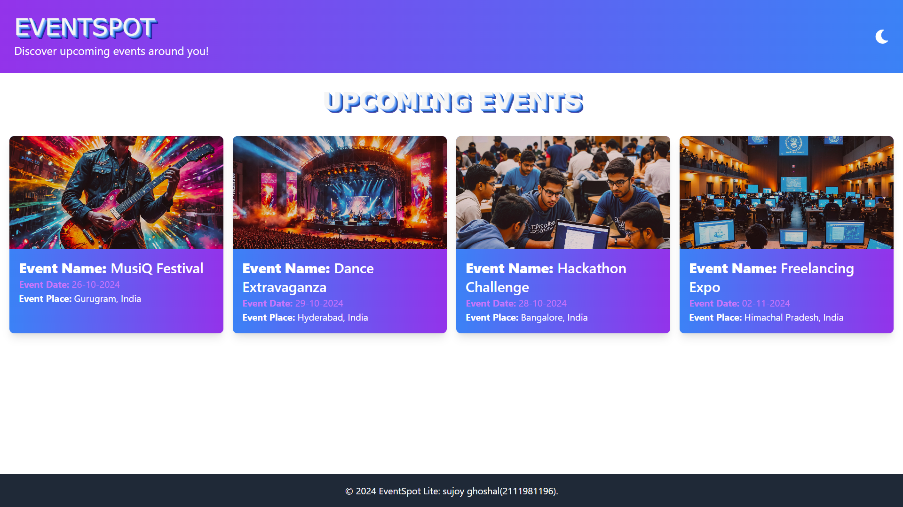
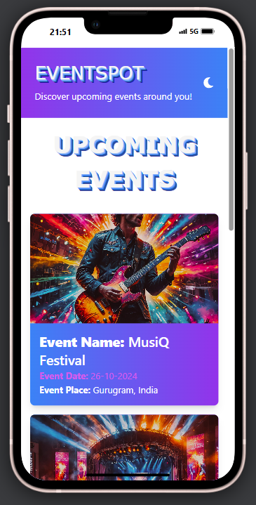
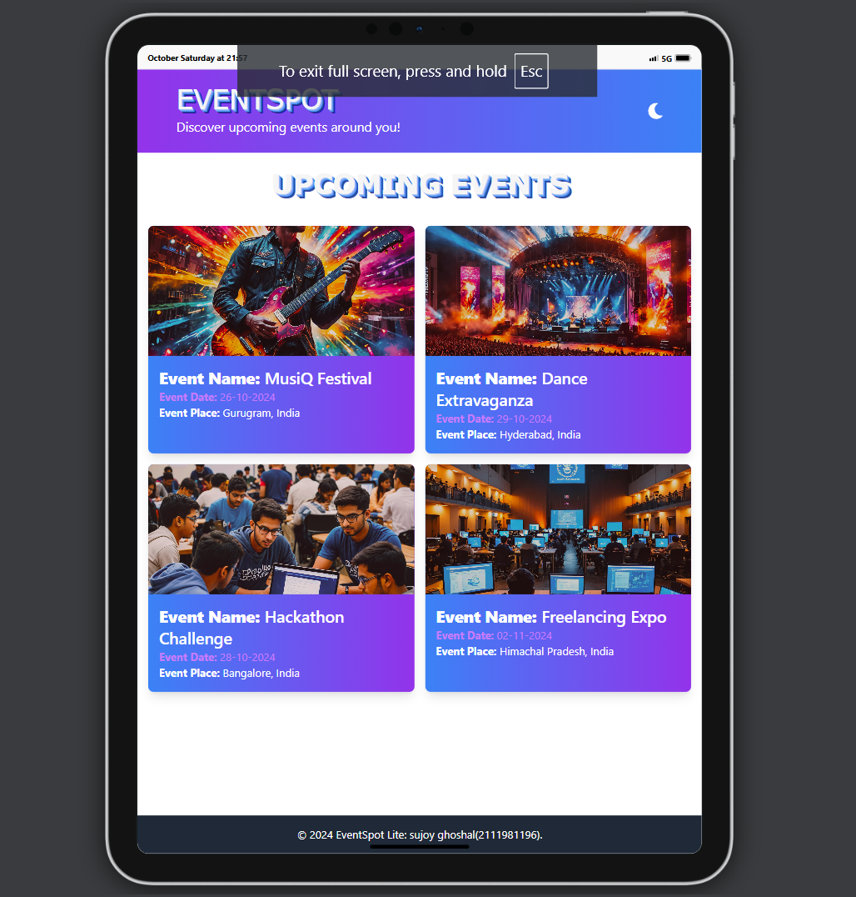
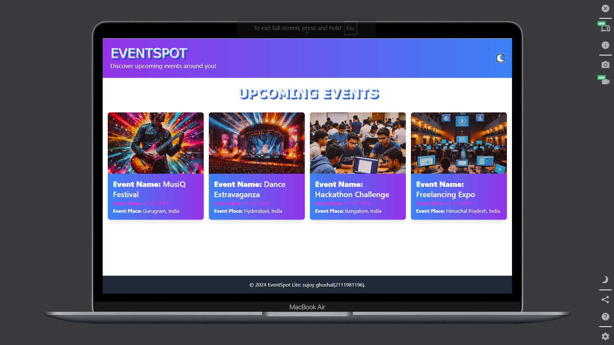

# EventSpot Lite
<p align="center">
  
</p>

<p align="center">
   &nbsp; 
   &nbsp; 
</p>

## Project Overview

**EventSpot Lite** is a **responsive single-page web application** for **discovering local events** with **clean animations**, **modern UI**, and **intuitive design**.

## Hosting & Access

The application is deployed and accessible at the following link:

- **Hosted Application URL**: [https:///](https:///)
- **Contact**: [suraj1279.be21@chitkarauniversity.edu.in](mailto:suraj1279.be21@chitkarauniversity.edu.in)


## Screenshots

| **Dashboard View**                          | **Mobile View**                          |
|---------------------------------------------|------------------------------------------|
|        |      |

| **Tablet View**                             | **Event Listing View**                   |
|---------------------------------------------|------------------------------------------|
|         |     |

## Table of Contents

- [Project Overview](#project-overview)
- [Features](#features)
- [Technology Stack](#technology-stack)
- [Setup & Installation](#setup--installation)
- [Screenshots](#screenshots)
- [Hosting & Access](#hosting--access)

## Features

| **Feature**                | **Description**                                                                                               |
|----------------------------|--------------------------------------------------------------------------------------------------------------|
| **Event Listing Page**     | Displays a list of events with event name, date, and location.                                               |
| **Search Functionality**   | Enables filtering events by name or location.                                                                |
| **Event Details Modal**    | Provides a detailed view of each event within a modal with fade animations.                                  |
| **Responsive Design**      | Ensures optimal display on desktop, tablet, and mobile devices.                                              |
| **Smooth Animations**      | Includes hover effects, modal transitions, and loading spinners for a polished UX.                           |


## Technology Stack

- **Frontend Framework**: React
- **Styling**: Tailwind CSS and CSS3 animations
- **Data**: Mock JSON data
- **Deployment**: Hosted on Vercel or GitHub Pages

## Setup & Installation

1. **Clone the Repository**
   ```bash
   git clone https://github.com/sujoyghoshal/Sujoy_Ghoshal_EventSpot-Lite.git
2. **Navigate to the Project Directory**
   ```bash
   cd EventSpotLite
3. **Install**
   ```bash
   npm i
